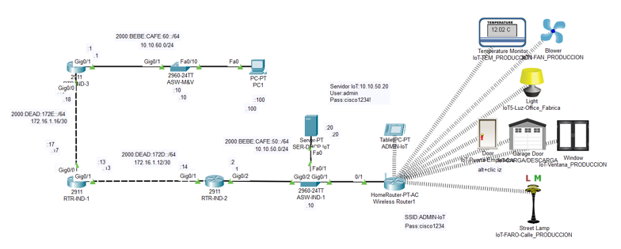
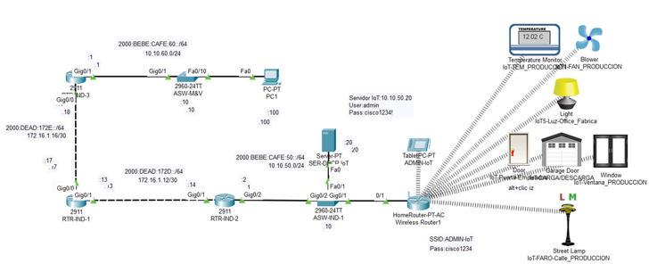
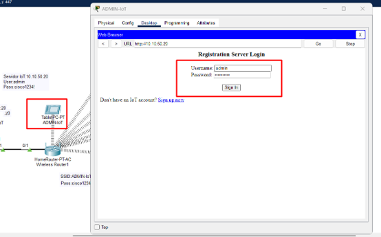
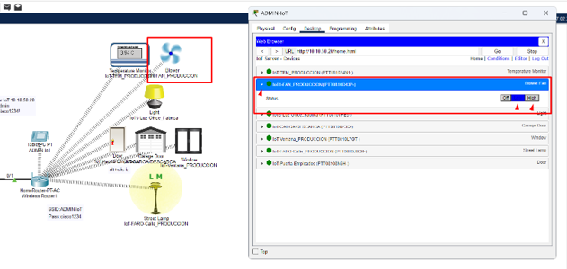
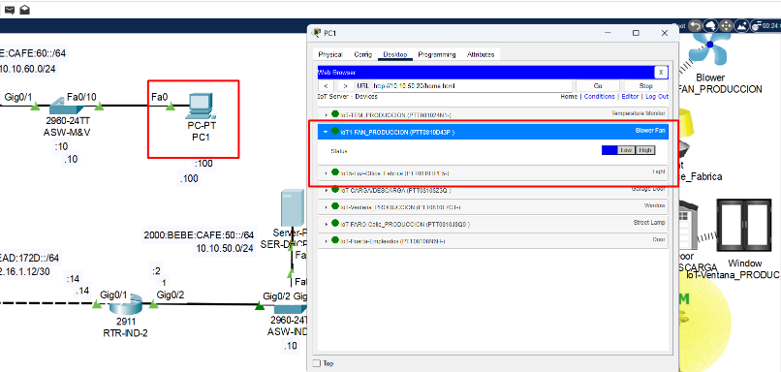
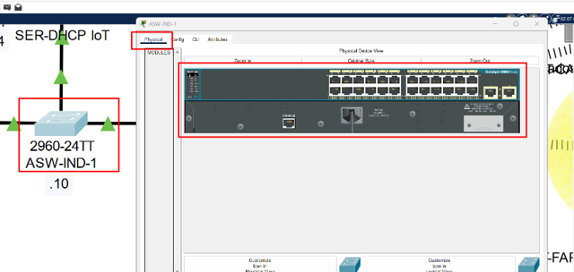
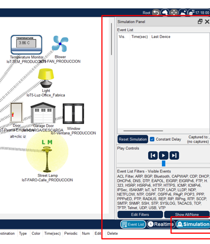
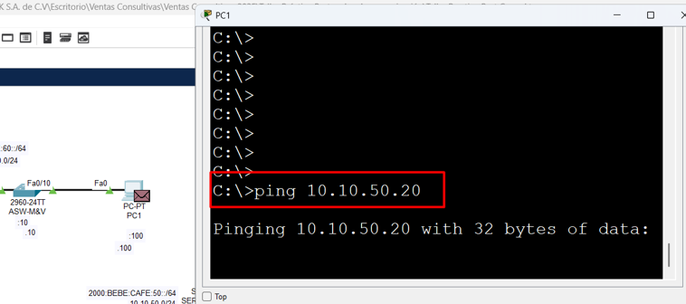
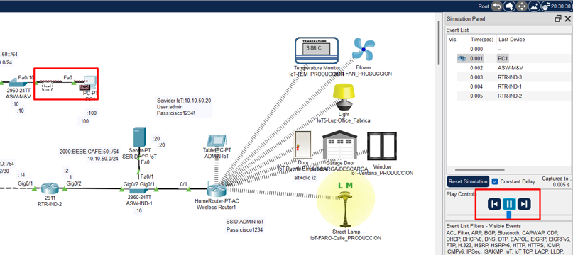
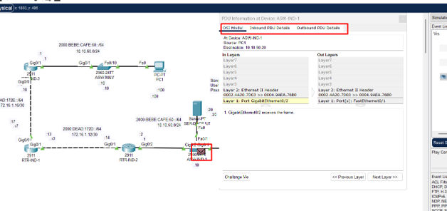

# Práctica 1.1. ¿Qué es una Red? / Caso de estudio

## Objetivo de la práctica:
El participante, lograra comprender las características generales de una red de comunicaciones  

Al finalizar la práctica, serás capaz de: 

- Comprender el concepto de una red  
- Identificara los componentes que mas  
- Visualizar las funciones básicas de una red  

## Objetivo visual 

## Duración aproximada:
- 30 minutos.

## Tabla de ayuda:

| Dispositivo     | Características        | Dirección / Contraseña                              | Credenciales                            |
|-----------------|------------------------|-----------------------------------------------------|-----------------------------------------|
| PC1             | Dispositivo Final      | 10.10.60.100/24                                     | N/A                                     |
| SER-DHCP IoT    | Servidor               | 10.10.50.2024                                       | Usuario: admin Contraseña: cisco1234! |
| ADMIN IoT       | Tablet                 | 10.10.50.50/24                                      | N/A                                     |
| Wireless router | AP                     | IPv4 (DHCP)                                         | N/A                                     |
| ASW-IND-1       | Switch                 | 10.10.50.10                                         | N/A                                     |
| RTR-IND-1       | Router / Núcleo        | G0/0: 172.16.1.17/30 G0/1: 172.16.1.13/30         | N/A                                     |
| RTR-IND-2       | Router / Default Gateway | G0/1: 172.16.1.14/30 G0/2: 10.10.50.1/24        | N/A                                     |
| RTR-IND-3       | Router / Default Gateway | G0/0: 172.16.1.14/30 G0/2: 10.10.60.1/24                               | N/A                                     |

## Instrucciones 

En esta actividad observaras como está conformada una red de comunicaciones básica, así que por el momento solo observaremos.

### Tarea 1. Analicemos los componentes de una red y veamos como trabaja 
Paso 1. Abre tu practica en formato Cisco Packet Tracert  y lo primero que veras es una red, esta red ya esta interconectada, configurada y funcional.

-	¿Reconoces alguno de estos dispositivos?
-	¿Has utilizado alguno de ellos?
- ¿Podrías enumerar las arquitecturas que conforman esta red?

Paso 2. Da clic sobre la Tablet, y da clic en Web Browser, se abrirá un explorador donde en la barra URL ingresa la  dirección IP 10.10.50.20, posteriormente te solicitará un loggin, ingresa  admin como usuario y cisco1234! como contraseña, finalmente da clic en el botón Sing in

Paso 3. Una vez que te logueaste correctamente podrás ver una lista de dispositivos, estos dispositivos son dispositivos IoT, con distintas funciones. Por ejemplo despliega a IoT1-FAN_PRODUCCION (PTT0810D43P-),y experimeta con las opciones (Low y Hight)

Como puedes observar lo estamos controlando a través de la red, lo mismo ocurre con los demás dispositivos IoT, recuerda que son objetos físicos que están conectados a internet y pueden recoger, enviar o recibir datos mediante sensores, software y otras tecnologías. Estos dispositivos pueden operar de forma autónoma o ser controlados a distancia, y están diseñados para mejorar la eficiencia, automatizar tareas y proporcionar información útil en tiempo real, y esto es posible gracias a una red de comunicaciones

Paso 4. Trata de repetir las instrucciones de los pasos 2 y 3 pero ahora desde PC1.

¿Lograste manipular los dispositivos IoT? Esto se debe a la comunicación de la red.

### Tarea 2. Analizar las características de los dispositivos de red.
Paso 1. Ingresa al switch ASW-IND-1, asegúrate de posicionarte en la pestaña Physical, donde podrás observar algunas de sus características físicas más allá de su icono.

Características de un switch:
- Se dice que un  swicth trabaja a nivel de capa 2.
- Es un dispositivo de acceso.
- Tiene alta densidad de puertos.
- Divide dominios de colisión.

> Nota: Si algunos de estos términos no te son familiares, no te preocupes, hablaremos de ellos más adelante.

Paso 2. Ingresa al router RTR-IND-2, asegúrate de posicionarte en la pestaña Physical, donde podrás observar algunas de sus características físicas más allá de su icono.

Características de un Router: 
- Se dice que trabaja a nivel de capa 3
- Es un dispositivo de distribución.
- Menos densidad de puestos en comparación con switch.
- Divide dominios de Broadcast 

> Nota: Si algunos de estos términos no te son familiares, no te preocupes, hablaremos de ellos más adelante.

### Tarea 3. Analiza como viaja la información.
Paso 1: En la interface de Cisco Packer Tracer, ubica en la esquina inferior derecha el icono se Simulation, da clic, aparecerá una ventana llamada Simulation panel.

Paso 1: En la interface de Cisco Packer Tracer, ubica en la esquina inferior derecha el icono se Simulation, da clic, aparecerá una ventana llamada Simulation panel.

Paso 2. Una vez que puedas ver el Simulation Panel, ingresa a la PC1 y envía un ping a la dirección 10.10.50.20  con el comando ping 10.10.50.20 y luego presiona la tecla enter

Paso 3. Regresa a el Sumulation Panel  y en la sección de Play control, da clic en el icono de play, podrás observar de forma gráfica como viajan los paquetes a lo largo de la red

Paso 4. Puede pausar la trayectoria de los paquetes desde la sección de play Controls en el Simulation Panel, da clic en alguno de los paquetes y visualiza la información que ofrece  las pestañas OSI Model, Inbound PDU Details  y Outbound PDU Details.

¿Alguna de esta información se te hace familiar?

### Resultado esperado
Como puedes ver una red de comunicaciones se conforma varios dispositivos que estarán interconectados entre sí, compartirán información para lograr que se ejecuten algunas acciones, estas acciones dependerán del por que o para que fue diseñada la red y lo que se este transportando, y todo esto no sería posible sin la interacción de un protocolo de comunicación. 
