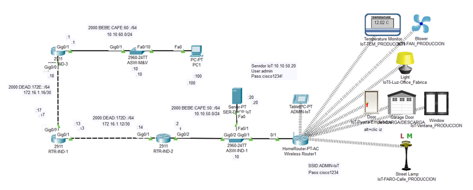

# Práctica 1.1. ¿Qué es una Red? / Caso de estudio

## Objetivo de la práctica:
El participante, lograra comprender las características generales de una red de comunicaciones  

Al finalizar la práctica, serás capaz de: 

- Comprender el concepto de una red  
- Identificara los componentes que mas  
- Visualizar las funciones básicas de una red  

## Objetivo Visual 
Crear un diagrama o imagen que resuma las actividades a realizar, un ejemplo es la siguiente imagen. 

## Duración aproximada:
- xx minutos.

## Tabla de ayuda:

## Instrucciones 

En esta actividad observaras como está conformada una red de comunicaciones básica, así que por el momento solo observaremos.

### Tarea 1. Analicemos los componentes de una red y veamos como trabaja 
Paso 1. Abre tu practica en formato Cisco Packet Tracert  y lo primero que veras es una red, esta red ya esta interconectada, configurada y funcional.

-	¿Reconoces alguno de estos dispositivos?
-	¿Has utilizado alguno de ellos?
- ¿Podrías enumerar las arquitecturas que conforman esta red?

Paso 2. Da clic sobre la Tablet, y da clic en Web Browser, se abrirá un explorador donde en la barra URL ingresa la  dirección IP 10.10.50.20, posteriormente te solicitará un loggin, ingresa  admin como usuario y cisco1234! como contraseña, finalmente da clic en el botón Sing in

### Tarea 2. Descripción de la tarea a realizar.
Paso 1. Debe de relatar el instructor en verbo infinito, claro y conciso cada actividad para ir construyendo paso a paso en el objetivo de la tarea.

Paso 2. <!-- Añadir instrucción -->

Paso 3. <!-- Añadir instrucción -->

### Resultado esperado
En esta sección, se debe mostrar el resultado esperado de nuestro laboratorio

