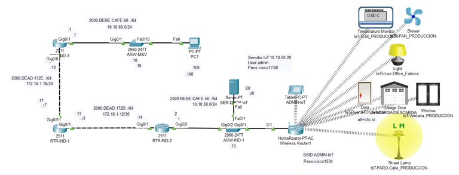
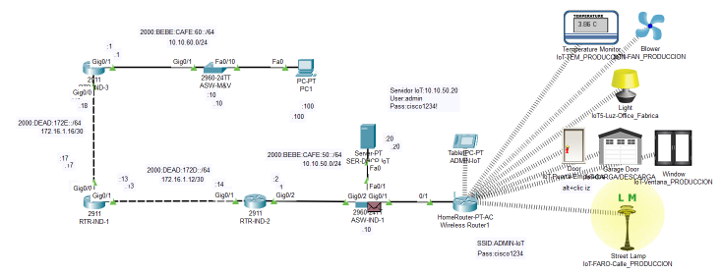
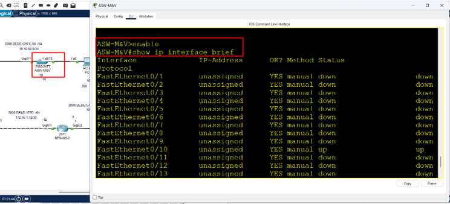
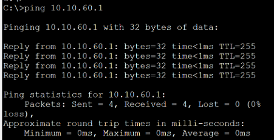
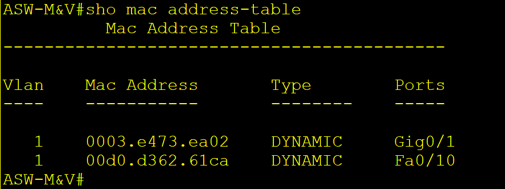
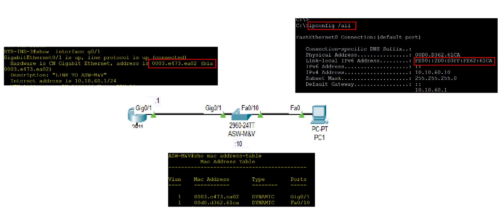
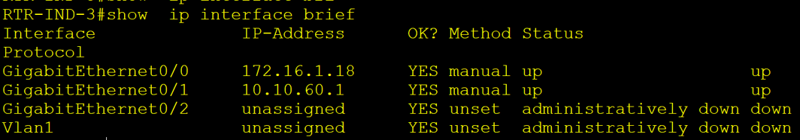
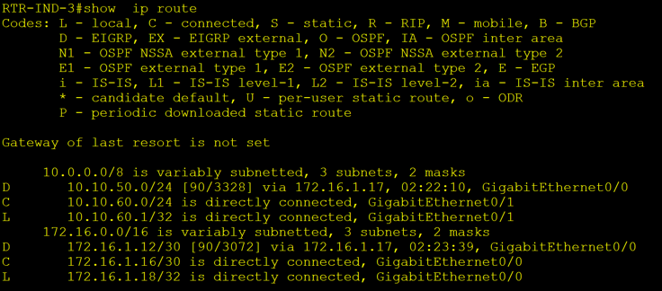

# Práctica 1.2. Aquitecturas y modelos de comunicación 

## Objetivo de la práctica:
Al finalizar la práctica, serás capaz de:
- Identificar los componentes de la arquitectura de red empresarial.
- Aprender a relacionar los componentes de la red tanto físicos como lógicos con los modelos de comunicación OSI y TCP/IP. 
- Aplicar la arquitectura de red empresarial en un diseño e implementación de la red. 
- Describir las capas del modelo OSI y TCP/IP que se relacionan directamente con la redes de comunicaciones.

## Objetivo visual 
Crear un diagrama o imagen que resuma las actividades a realizar, un ejemplo es la siguiente imagen. 

## Duración aproximada:
- 40 minutos.

## Tabla de ayuda:

| Dispositivo     | Características        | Dirección / Contraseña                              | Credenciales                            |
|-----------------|------------------------|-----------------------------------------------------|-----------------------------------------|
| PC1             | Dispositivo Final      | 10.10.60.100/24                                     | N/A                                     |
| SER-DHCP IoT    | Servidor               | 10.10.50.2024                                       | Usuario: admin Contraseña: cisco1234! |
| ADMIN IoT       | Tablet                 | 10.10.50.50/24                                      | N/A                                     |
| Wireless router | AP                     | IPv4 (DHCP)                                         | N/A                                     |
| ASW-IND-1       | Switch                 | 10.10.50.10                                         | N/A                                     |
| RTR-IND-1       | Router / Núcleo        | G0/0: 172.16.1.17/30 G0/1: 172.16.1.13/30         | N/A                                     |
| RTR-IND-2       | Router / Default Gateway | G0/1: 172.16.1.14/30 G0/2: 10.10.50.1/24        | N/A                                     |
| RTR-IND-3       | Router / Default Gateway | G0/0: 172.16.1.18/30 G0/1: 10.10.60.1/24                               | N/A                                     |

## Instrucciones 
Vamos a identificar los elementos de la arquitectura de red empresarial en la red que ya tenemos funcionando.

### Tarea 1. Identificar las capas de la arquitectura de red empresarial en tu topología.
Paso 1. Analiza de forma visual los dispositivos disponibles y trata de responder las siguientes preguntas.

- *¿Qué dispositivos corresponden a la capa de acceso?*
- *¿Qué dispositivos corresponden a la capa de distribución?* 
- *¿Logras identificar que dispositivo o dispositivos corresponden a la capa de núcleo?, ¿por qué?* 

### Tarea 2. 
### Verificar los elementos correspondientes a la cap 1 y 2 tomando en cuenta el modelo de referencia OSI y TCP/IP.
### Verificar los elementos correspondientes a la capa de enlace (link) tomando en cuenta el modelo Stack TCP/IP.

Paso 1. Ingresa el **swicth ASW-M&V**. Pasa a modo de Exec Privilegiado y ejecuta el comando `show ip int brief` como se muestra en la imagen.

Este comando te muestra el estado de las interfaces a nivel físico y lógico, es decir al nivel de la capa 1 y 2. Por ejemplo, compara las interfaces FastEthernet 0/10 y FastEthernet 0/11. 

Como podrás ver la interface **FastEthernet 0/10** tiene un estado *UP - UP*, es decir, esta activa y lista para reenviar información; por otro lado, la interface **FastEthernet 0/11**, esta *DOWN - DOWN*, es decir que esta inactiva, no podría reenviar información. 

Paso 2. Ahora, verifica el direccionamiento de la capa 2. Ingresa a la PC1 y manda un ping al router como se muestra en la imagen:  

Posteriormente en el **Switch ASW-M&V**, desde el modo de Exec privilegiado, ejecuta el comando `show mac address-table` como se muestra en la imagen.

Como recordaras los switches trabajan a nivel de capa 2, es decir con direccionamiento MAC, lo que estas observando es como el switch aprende donde están ubicados los dispositivos a los cuales se les tiene que reenviar la información.  

Puedes corroborar las direcciones MAC como se muestra en la imagen.  

Puedes notar que el switch a creado la tabla MAC con el paso de información a través de sus puertos, y ahora sabe que la dirección **MAC 00D0.D362.61CA** (PC 1) la logra alcanzar a través de la interface **Fa0/10** y que la **MAC 0003.e473.ea02** la puede alcanzar a través de sus interfaces **G0/1**. 

> Nota: Las MAC pueden llegar a ser diferentes. 

### Tarea 3.  
### Verificar los elementos correspondientes a la cap 3 tomando en cuenta el modelo de referencia OSI y TCP/IP.
### Verificar los elementos correspondientes a la capa de Internet tomando en cuenta el modelo Stack TCP/IP.

Paso 1. Como habrás notado, necesitamos el direccionamiento de la capa 2 y 3 para enviar y recibir información a través de la red. Verifica el direccionamiento IP (capa 3 en la PC 1) usando en la consola el comando `ipconfig /all` como se muestra en la imagen:  

Observa que, además de la dirección MAC, también tiene una dirección IP.  

Paso 2. Verifica el direccionamiento IP en el Router **RTR-IND-3**, ingresando a la consola y ejecutando el comando `show ip interface brief`, como se muestra en la imagen: 

A diferencia del switch que solo tiene capacidad de capa 2, el router si cuenta con soporte por default para ser configurado con direccionamiento de capa 3, es decir direccionamiento IP. 

Paso 3. Dentro del mismo router RTR-IND-3 puedes comprobar su principal función que es el enrutamiento. En modo de Exec privilegiado, ingresa el comando `show ip route` como se muestra en la imagen.

En este caso, el router también tiene una tabla donde almacena información, solo que, a diferencia de un switch, está basada en la información de los segmentos de red IP que se encuentran tanto directamente conectados, como de forma remota. 

Con ayuda de tu instructor trata de identificar las redes que conoce este router de acuerdo a tu topología.  

### Resultado esperado 

Logramos ver la aplicación de una arquitectura de red empresarial, así como la referencia de distintas tecnologías y protocolos dentro del modelo OSI así como del Stack TCP/IP. 
