# Práctica 1.3. Implementación básica de una red

## Objetivo de la práctica:
Al finalizar la práctica, serás capaz de:
- Simular la implementación de una topología de red en Cisco Packet Tracert.  
- Realizar la configuración básica de los equipos de red básicos y de un protocolo ruteable y de re-ruteo.  

## Objetivo visual:

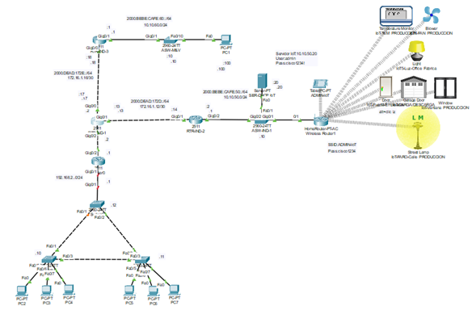

## Duración aproximada:
- 40 minutos.

## Tabla de ayuda:

| Dispositivo      | Características                            | Dirección / Contraseña                                                              | Credenciales                                |
|------------------|---------------------------------------------|--------------------------------------------------------------------------------------|---------------------------------------------|
| PC1              | Dispositivo Final                          | 10.10.60.100/24                                                                      | N/A                                         |
| SER-DHCP IoT     | Servidor                                   | 10.10.50.2024                                                                        | Usuario: admin<br>Contraseña: cisco1234!    |
| ADMIN IoT        | Tablet                                     | 10.10.50.50/24                                                                       | N/A                                         |
| PCs              | Dispositivos finales                       | IPv4 DHCP                                                                            | N/A                                         |
| Wireless router  | AP                                         | IPv4 (DHCP)                                                                          | N/A                                         |
| ASW-IND-1        | Switch (ACCESO)                            | 10.10.50.10                                                                          | N/A                                         |
| ASW-1            | Switch (ACCESO)                            | 192.168.1.10                                                                         | N/A                                         |
| ASW-2            | Switch (ACCESO)                            | 192.168.1.11                                                                         | N/A                                         |
| ASW-3            | Switch (ACCESO)                            | 192.168.1.12                                                                         | N/A                                         |
| RTR-IND-1        | Router / (Núcleo)                          | G0/0: 172.16.1.17/30<br>G0/1: 172.16.1.13/30<br>G0/0: 192.168.2.2/24                 | N/A                                         |
| RTR-IND-2        | Router / Default Gateway / (Distribución) | G0/1: 172.16.1.14/30<br>G0/2: 10.10.50.1/24                                          | N/A                                         |
| RTR-IND-3        | Router / Default Gateway / (Distribución) | G0/0: 172.16.1.18/30<br>G0/1: 10.10.60.1/24                                          | N/A                                         |
| RTR-OFFICE       | Router / Default Gateway / (Distribución) | G0/1: 192.168.1.1/24<br>G0/2: 192.168.1.2/24                                         | N/A                                         |

---

**[⬅️ Atrás](https://netec-mx.github.io/TPRACT_PROT_COM/Cap%C3%ADtulo2/)** | **[Lista General](https://netec-mx.github.io/TPRACT_PROT_COM/)** | **[Siguiente ➡️](https://netec-mx.github.io/TPRACT_PROT_COM/Cap%C3%ADtulo4/)**

---

## Instrucciones: 

### Tarea 1. Agregar los dispositivos que darán forma a nuestra red. 

Paso 1. Considerando la arquitectura de red empresarial, vamos construir la capa de acceso de nuestra topología. En la parte inferior izquierda, haz clic en el ícono del switch, arrastra tres switches modelo **2960** y colócalos en forma de triángulo, tal como se muestra en la imagen.  

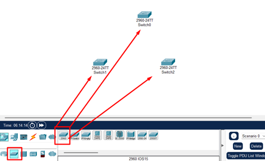

Cablea los equipos. 

En la parte inferior izquierda, encontrarás un ícono similar a un rayo. Haz clic en él para visualizar los cables disponibles. Selecciona el cable crossover y conéctalos tal como se muestra en la imagen. 

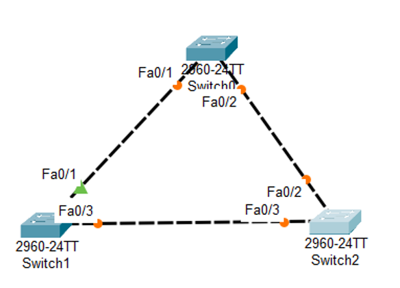

Repite los pasos anteriores, pero en esta ocasión con PCs (tres por cada switch que este en la parte inferior), tal como se muestra en la imagen. 

> Nota: Procura usar los puertos **Fa0/5** a **Fa0/8** y utiliza cables Straight-Trough. En las PC se debe de conectar en los puertos **FastEthernet0**.

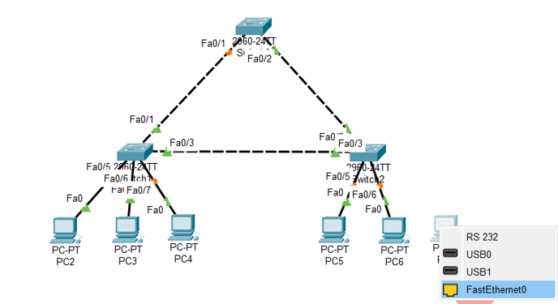

Paso 2. Construye la capa de distribución. 

En la parte inferior izquierda, haz clic en el ícono de routers. Con el ratón, selecciona un router **2911** y arrástralo a tu topología, tal como se muestra en la imagen. 

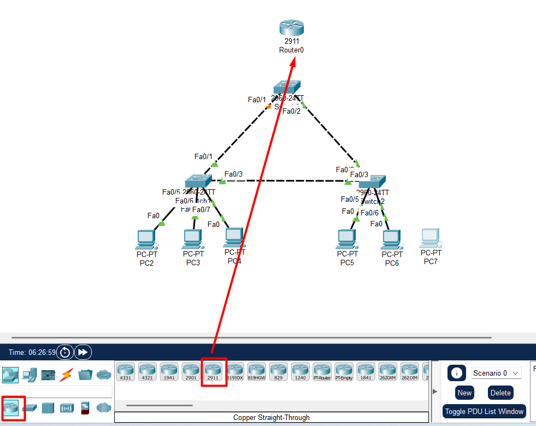

Realiza el cableado. Selecciona un cable **Straight-Trough** para conectar la interfaz **G0/1** del switch a la interface **G0/1** del router. Después, usa un cable **Cross-Over** para conectarlo de la interface **G0/2** del router recién colocado a la interface **G0/2** del router RTR-IND-1. 

La topología debería verse como la imagen.  

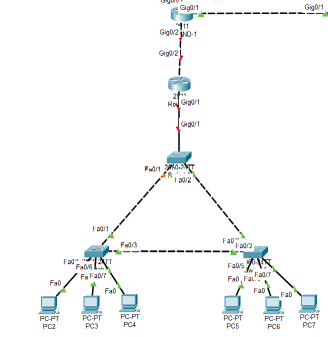

Paso 3. Una vez que tu topología esté completa, posiciónate en el swicth que está en la *“punta del triángulo”*. Ve a modo **Exec Privilegiado** y ejecuta el siguiente comando:

```
show cdp neighbors
```

Analiza los resultados junto a tu instructor.  

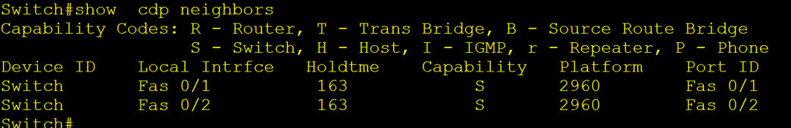

CDP es un protocolo de capa 2 que proporciona información de los dispositivos directamente conectados. Sin embargo, sin una configuración apropiada, esta información puede llegar a ser confusa. Por ejemplo, actualmente nos muestra que está conectado a dos dispositivos llamados switch, lo que significa que por el momento todos tienen el mismo nombre. 

### Tarea 2. Configuración básica de los dispositivos de capa 2 ( switches). 

Paso 1. Configura los parámetros básicos en los swicthes, siguiendo el modelo que se muestra en la imagen.

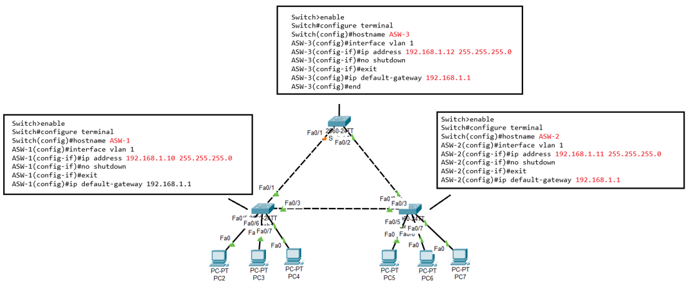

Paso 2. Regresa a la consola, ahora llamada **ASW-3**y ejecuta nuevamente el comando:

```
show cdp neighbors
```

 Observa las diferencias.  

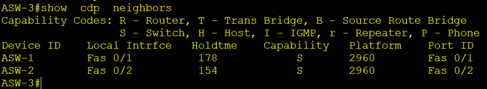

¿Ahora ves la diferencia? Aún no logramos ver al router que está directamente conectado, se debe a que aún no está configurado. 

Paso 3. Accede a la consola del router que agregaste en esta actividad y configúralo según las indicaciones de la imagen: 

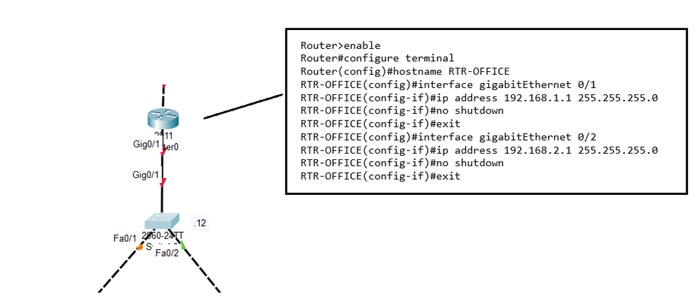

Comprueba la eficacia de tus configuraciones con un ping. Desde el router **RTR-OFFICE**, envía un ping a los switches.

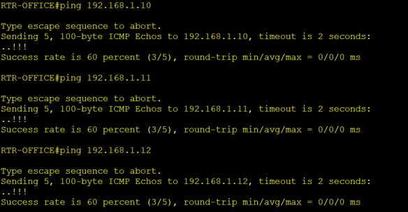

¿Puedes decir qué otros protocolos están presentes en la red que acabas de configurar? Corrobóralo con tu instructor.  
 
### Tarea 3. Generar comunicación entre las redes.

Ahora que la comunicación local entre los dispositivos de red recién agregados está establecida, debemos garantizar la conectividad entre la nueva red y la existente. 

Paso 1. Ingresa al router **RTR-OFFICE**, desde el modo **Exec Privilegiado**, y ejecuta el siguiente comando:

```
show ip route
```

Analiza la salida.  

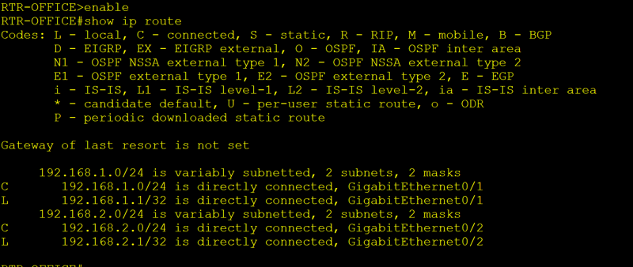

Como puedes ver, el router nuevo no conoce cómo llegar a las redes remotas; únicamente reconoce las redes a las que está directamente conectado. Por lo tanto, debemos hacer que aprenda, o en este caso, que los demás routers le enseñen cómo alcanzar las demás redes.

Paso 2. Ingresa al router RTR-OFFICE, ingresa al modo de configuración global y configura el protocolo **EIGRP**, como se muestra en la imagen:  

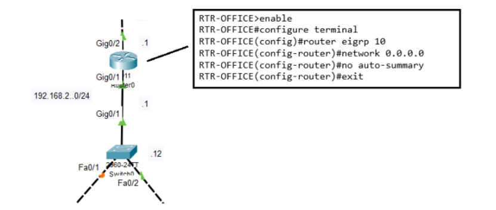

Desde el modo de **Exec privilegiado**, ingresa nuevamente el comando:

```
show ip route
```

Observa la diferencia.  

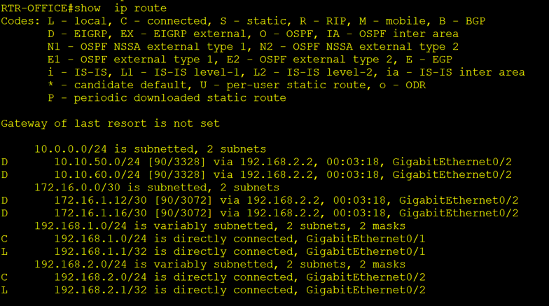

Ahora, conoce el resto de las redes.  

### Resultado esperado: 

En esta práctica, puedes observar cómo los protocolos de diferentes capas comienzan a dar vida a tu red. Algunos protocolos presentes en este punto son:  

- Capa 2: CDP,  STP 
- Capa 3: IP, EIGRP 

Además, es posible identificar algunas topologías implementadas, como estrella y anillo.

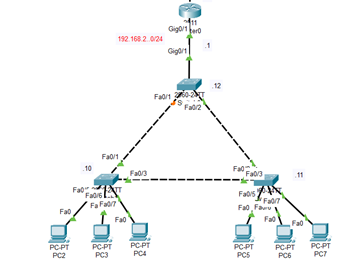
