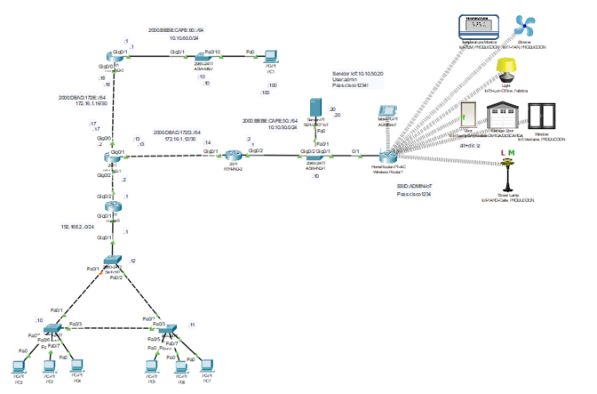
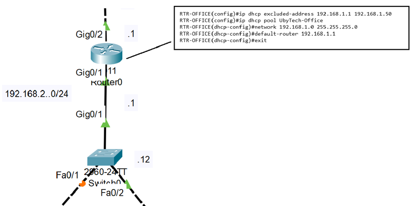
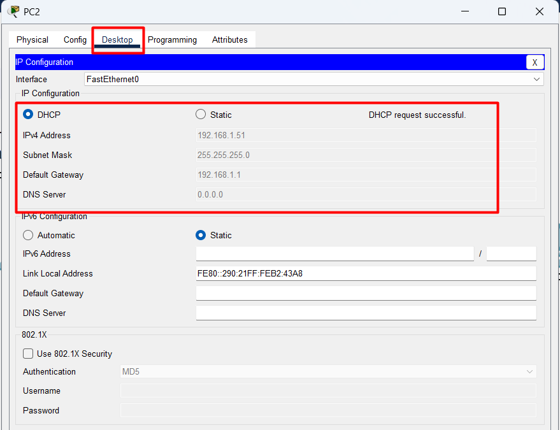
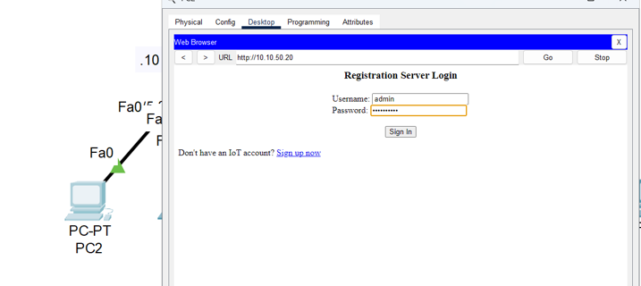
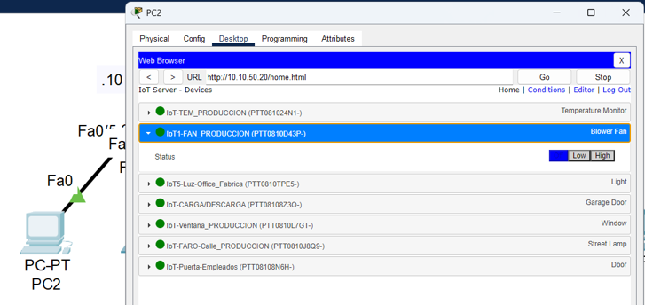
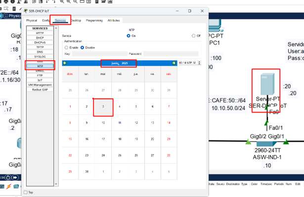
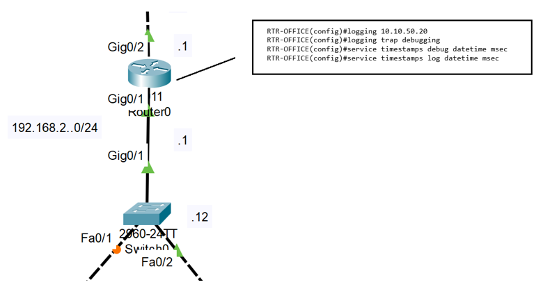
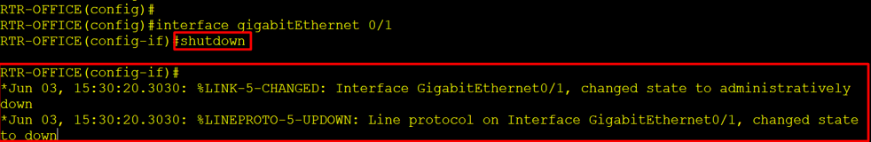
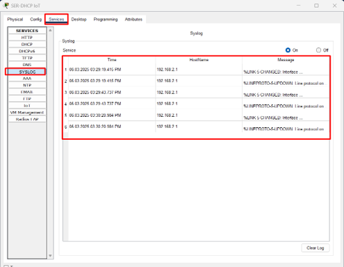

# Práctica 1.4. Protocolos y servicios de red

## Objetivo de la práctica:
Al finalizar la práctica, serás capaz de:

- Configuración del direccionamiento IP en los dispositivos finales de forma dinámica 
- Implementar NTP para garantizar los servicios de tiempo en los dispositivos de red 
- implementación de syslog para garantizar tener la información adecuada en una   auditoria de red

## Objetivo visual 
Crear un diagrama o imagen que resuma las actividades a realizar, un ejemplo es la siguiente imagen. 

## Duración aproximada:
- 20 minutos.

## Tabla de ayuda:

Hasta este punto ya tenemos conectividad completa en nuestra nueva red, pero solo a nivel de dispositivos de red, por lo que implementaremos algunos protocolos para garantizar que también los dispositivos finales puedan comunicarse  

## Instrucciones 

### Tarea 1. 
En primero lugar configuraremos un protocolo  muy popular llamado DHCP que asignara direccionamiento IP a nuestros dispositivos finales como. 

Paso 1. Ingresa a el router RTR-OFFICE y configura DHCP en modo de configuración global como se muestra en la imagen.  

Paso 2.  Hora a las PC y configurarla para recibir información del protocolo IP mediante DHCP 

Como podrás ver, casi de forma inmediata adquieren su dirección IP, mascara de subred y default Gateway. 

Paso 3. De forma muy básica ya puedes tener acceso a las aplicaciones de red como la administración de los dispositivos de IoT, para comprobarlo, en cualquiera de las PC que ya cuentan con direccionamiento IP abre un explorador e ingresa la IP 10.10.50.20 e ingresa las credenciales user:admin   password: cisco1234! 

Como veras ya tienes control de los dispositivos de IoT, comprobando que ya tenemos conectividad completa  

### Tarea 2. 
La administración del tiempo es importante para que una red funcione de forma óptima, el que los dispositivos estén sincronizados en cuanto a fecha y hora es necesarios para las estampas de tiempo, actualizaciones etc, por lo que configuraremos NTP ( Network Time Protocol) 

Paso 1. Ingresa al servidor  SER-DHCP IoT , en la pestaña de Services y en el menú de Services selecciona NTP y configura el servicio de NTP con la  hora actual, como se muestra en la imagen. 

Paso 2. Ahora  ve al router RTR-OFFICE, y verifica la hora actual del dispositivos con el comando show clock en modo Exec Privilegiado y verifica la hora con la que esta configurado el dispositivo como  se muestra en la imagen 

Paso 3. Ahora ingresa al modo de configuración global y configura el servicio de NTP como se muestra en la imagen  

Nota: deberás esperar alrededor de 5 minutos para ver  una actualización, mientras puedes seguir con la siguiente tarea  

Tarea 3:  A veces es necesario saber la historia de ciertos eventos, el recopilar información, sobre lo que ocurre en la red es importante, por lo que ahora vamos a configurar el protocolo syslog para almacenar de forma centralizada los mensajes no solicitados  

Paso 1. Ingresa nuevamente al router RTR-OFFICE, de ahí navega hasta el modo de configuración global y configura syslog como se muestra en la imagen  

Paso 2. Ahora simula una falla en tu red, ingresa a la interface  G0/1 y  apaga la interface con el comando shutdown, veremos como aparecen una mensajes indicando lo ocurrido.

Paso 3. Ahora ve al servidor SER-DHCP-IoT en la pestaña de Services, selecciona SYSLOG, y podrás ver como se almacenaron los log en el servidor, también puedes notar que tienen su estampa de tiempo acorde a la hora actual  

Puedes encender de nuevo la interface G0/1 con el comando no shutdown y veras como se incrementan los logs en el servidor  

### Resultado esperado 

Comprender la diferencia y aplicación entre los diferentes protocolos existentes en una red: 

Protocolo Ruteables  

Protocolos de ruteo 

Protocolos de administración  

Comprender la importancia de las implementaciones centralizadas en la implementación y administración de una red  

 
